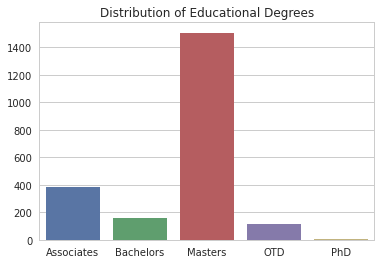
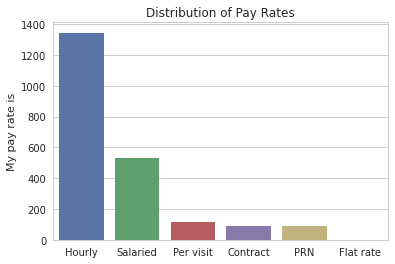
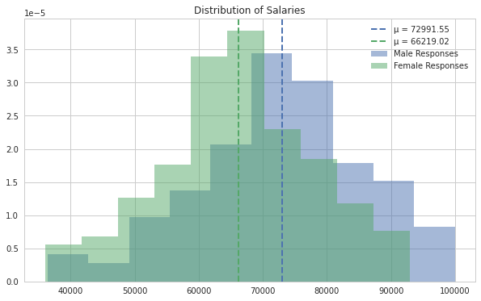
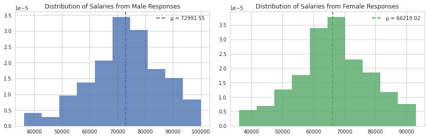
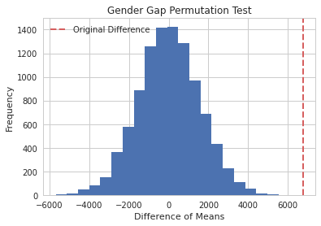
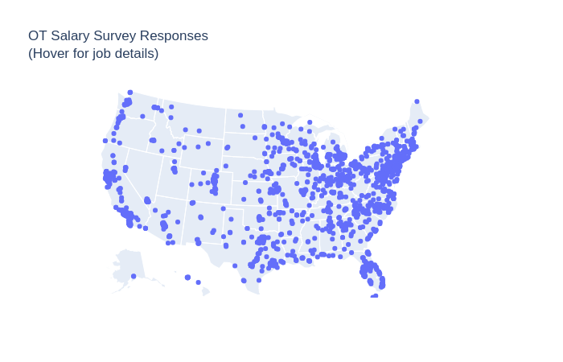
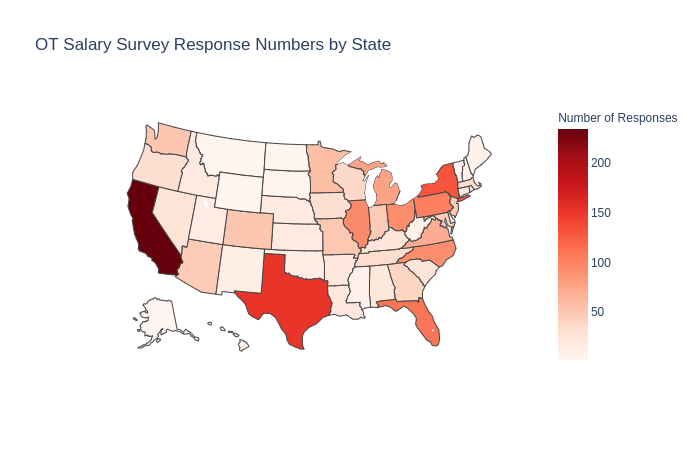
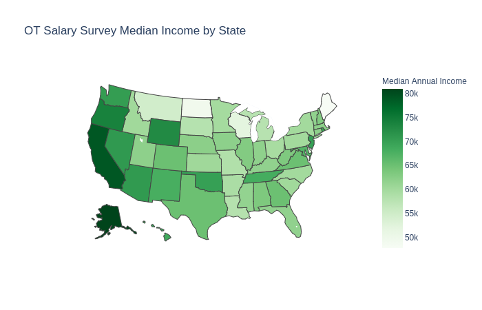

# OT-Salary-Analysis-and-Prediction
Occupational salary data taken from a survey from otsalary.com. Data is cleaned/wrangled, analyzed, and used to make a predictor based on a regression model.
The original dataset contains 2376 raw survey responses.

Exploratory data analysis (EDA) showed mistakes in input e.g.
1. Annual Salary > $300k, but only ~$40 per hour
2. Annual salary < $20k, but similar pay per hour
3. Inputting "74.0" possibly to represent 74,000 or 74k.
4. Not specifying currency (from international responses)

Any inputs similar to the above are omitted and not considered in the analysis. We also restrict analysis to US responses for simplicity. The result is 2176 responses.

## OT - COTA

Most responses are from OTs.

## Educational Degrees

Most responses are from individuals who have acquired a masters degree.

## Payrates

Most workers are paid hourly, with are salaried.

# Analysis of Wage Gap

There were 13 responses that preferred not to give their gender, and were therefore omitted. We also compare individuals with masters degrees and are OTs to have a similar comparison. This totals to 114 male responses, 1234 female responses, for a total of 1348 total responses.

On average, males make $72,991.55, and females make $66,219.02. The difference of means is $6772.53. We first use a series of statistical tests to determine if the difference of means is significant. We apply a Shapiro-Wilk test to both, and see that the distribution of female salaries is not gaussian. However, with Levene's test, we see that the data is homoscedastic. With a relatively large enough sample size, we apply a two-sided t-test. With a p-value on the magnitude of 1e-08, we reject the null hypothesis, and determine that the means do not come from the same distribution.

## Permutation Test

We observe the same scenario when applying a permutation test to the data. We use a random sampling version of the permutation test for 20,000 iterations and show that the original difference of means lies far out from the distribution of permuted difference of means. This further supports the idea that a wage gap exists between these two classes. From this dataset, we can determine that of the people who responded, female OTs with a masters degree make 9.28% less than male OTs with a masters degree.

# Visualizing Response Information

